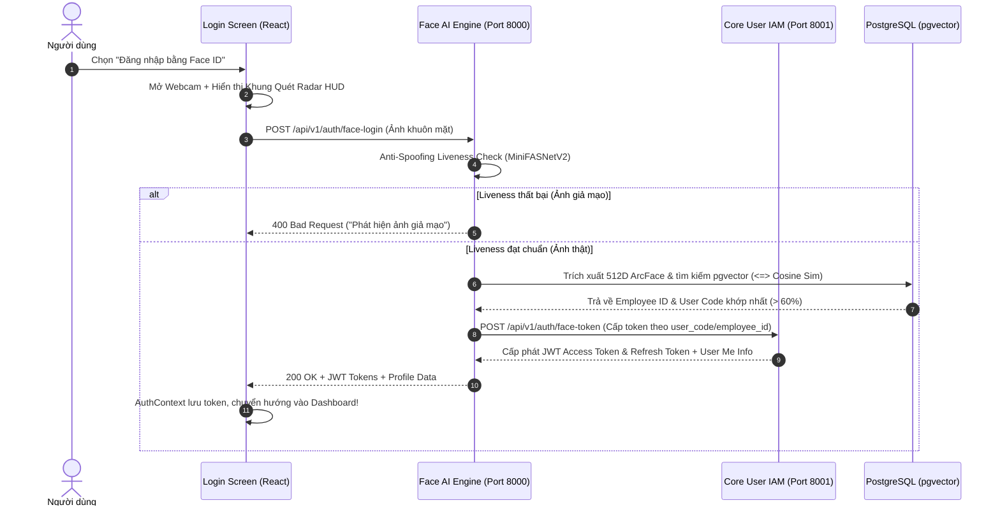

# Thiết Kế Chi Tiết: Tính Năng Đăng Nhập Bằng Khuôn Mặt (Face ID Login)

**Ngày thiết kế:** 2026-08-28  
**Tác giả:** Antigravity AI  
**Mục tiêu:** Cung cấp tính năng đăng nhập không cần mật khẩu bằng sinh trắc học khuôn mặt (1-Click Face ID Login), tích hợp công nghệ chống giả mạo Liveness Detection và đối chiếu pgvector 512D.

---

## 1. Tổng Quan Kiến Trúc (Architecture Overview)

Hệ thống triển khai tính năng Face Login thông qua sự phối hợp giữa:
1. **Frontend (React 19 + Vite)**: Màn hình `Login.jsx` hỗ trợ 2 chế độ: Đăng nhập bằng Mật khẩu hoặc Đăng nhập bằng Face ID (tích hợp Webcam HUD quét radar sinh trắc học).
2. **Face AI Backend (FastAPI, Port 8000)**: Xử lý Anti-Spoofing Liveness (MiniFASNetV2), trích xuất vector 512D InsightFace ArcFace, tìm kiếm khoảng cách Cosine Distance trên PostgreSQL `pgvector`.
3. **Core User Service (FastAPI, Port 8001)**: Quản lý tài khoản IAM, kiểm tra trạng thái hoạt động và cấp phát cặp JWT Access Token / Refresh Token cho người dùng được xác thực.



---

## 2. Chi Tiết Các Phân Hệ & Endpoint API

### 2.1. Core User Service (Port 8001)
- **Endpoint mới**: `POST /api/v1/auth/face-token` (hoặc `POST /api/v1/auth/internal-token`)
  - **Mục đích**: Cấp phát JWT Access Token cho nhân sự đã được Face AI Engine xác thực thành công.
  - **Input Payload**:
    ```json
    {
      "user_code": "NV001",
      "employee_id": "0fd89b3a-58dd-4c44-bde3-16ec4917aaa4",
      "secret_key": "vface_internal_service_secret"
    }
    ```
  - **Output**: `TokenResponse` (access_token, refresh_token, token_type, expires_in, user info).

### 2.2. Face AI Backend (Port 8000)
- **Endpoint mới**: `POST /api/v1/auth/face-login`
  - **Input**: `image: UploadFile` (Multipart Form Data)
  - **Quy trình xử lý**:
    1. Kiểm tra Liveness bằng `liveness_detector.predict(image_bytes)` (ngưỡng `>= 0.60`). Nếu phát hiện spoofing -> Trả về lỗi 400.
    2. Trích xuất đặc trưng khuôn mặt 512D bằng `face_engine.extract_single_face(image_bytes)`.
    3. Tìm kiếm trong bảng `face_features` của `pgvector` với hàm khoảng cách `<=>` (Cosine Distance).
    4. Nếu khoảng cách `< 0.40` (Tương đồng `> 60%`), lấy thông tin `employee` (`employee_code`, `full_name`).
    5. Gọi sang Core User Service `POST /api/v1/auth/face-token` để lấy JWT Access Token.
    6. Trả về token và thông tin nhân viên cho frontend.

### 2.3. Frontend (`Login.jsx`, `api.js`, `AuthContext.jsx`, `en.js`, `vi.js`)
- Thêm Tab chuyển đổi: **`[ 🔑 Mật khẩu ]`** vs **`[ 🎭 Face ID ]`**.
- Modal / Khung camera trực tiếp với vòng tròn neon glowing, hướng dẫn nhận diện và hiệu ứng radar quét.
- Khi người dùng xuất hiện trước camera hoặc bấm **"📸 Nhận Diện & Đăng Nhập"**:
  - Chụp snapshot canvas -> Gửi `api.faceLogin(blob)`.
  - Nếu thành công: hiển thị chào mừng `Xin chào, [Tên nhân viên]!` và tự động chuyển trang vào ứng dụng.
  - Hỗ trợ đầy đủ i18n 100% Tiếng Việt và Tiếng Anh.

---

## 3. An Toàn Bảo Mật & Xử Lý Lỗi (Security & Edge Cases)

1. **Chống giả mạo sinh trắc học (Anti-Spoofing)**: Sử dụng mạng nơ-ron MiniFASNetV2 ngăn chặn hoàn toàn việc in ảnh màu, ảnh trên smartphone, tablet hoặc video lặp lại.
2. **Ngưỡng nhận diện an toàn**: Chỉ chấp nhận khi độ tương đồng Cosine Similarity $\ge 60\%$ (khoảng cách pgvector $\le 0.40$).
3. **Trạng thái tài khoản**: Kiểm tra tài khoản `is_active == True` trong Core User IAM. Nếu tài khoản bị vô hiệu hóa sẽ từ chối đăng nhập.
4. **Fallback mượt mà**: Luôn giữ nút chuyển đổi sang Đăng nhập Mật khẩu truyền thống nếu thiết bị không có camera hoặc ánh sáng yếu.

---

## 4. Kế Hoạch Kiểm Thử Tự Động (Verification Plan)
- Cập nhật test case mới vào [test_e2e_full_system.py](file:///c:/Code/v-face-ai/tests/test_e2e_full_system.py):
  - Test Face Login với ảnh khuôn mặt hợp lệ -> Xác nhận nhận được JWT Access Token hợp lệ.
  - Test Face Login với ảnh không tồn tại -> Xác nhận nhận mã lỗi 404 / 401 thích hợp.
  - Test đăng nhập vào dashboard bằng JWT sinh từ Face ID.
